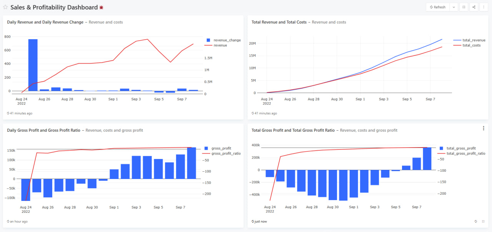
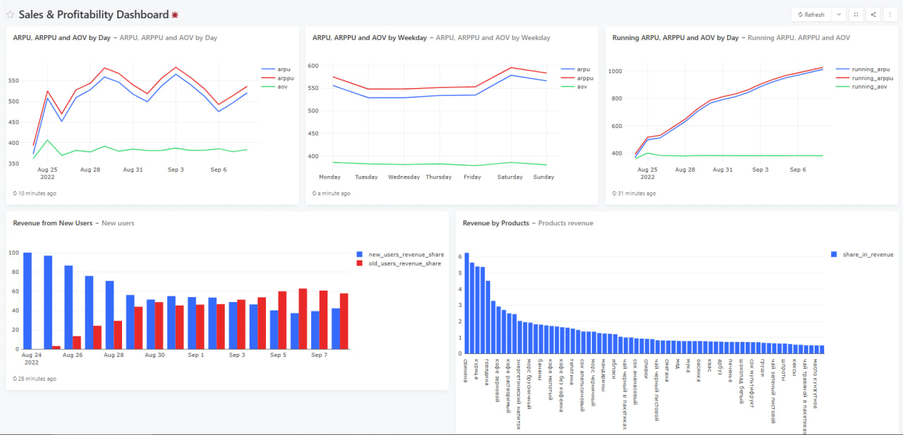

# Анализ службы доставки

SQL-анализ финансовых и продуктовых показателей сервиса доставки товаров.

## О проекте

Цель проекта — проанализировать выручку, затраты и прибыльность сервиса, а также оценить ключевые показатели монетизации пользователей.

В рамках проекта были рассчитаны основные финансовые и продуктовые метрики и собран дашборд в Redash.

## Дашборд

Дашборд включает следующие визуализации:

- Daily Revenue и изменение выручки
- Total Revenue и Total Costs
- Daily Gross Profit и Gross Profit Ratio
- Total Gross Profit и Total Gross Profit Ratio
- ARPU, ARPPU и AOV по дням
- ARPU, ARPPU и AOV по дням недели
- Running ARPU, ARPPU и AOV
- Revenue from New Users
- Revenue by Products

### Скриншоты

#### Dashboard — часть 1

#### Dashboard — часть 2

## Основные метрики

В проекте рассчитаны:

- **Revenue** — выручка
- **Costs** — затраты
- **Gross Profit** — валовая прибыль
- **Gross Profit Ratio** — рентабельность по валовой прибыли
- **ARPU** — средняя выручка на пользователя
- **ARPPU** — средняя выручка на платящего пользователя
- **AOV** — средний чек
- **Running ARPU / ARPPU / AOV** — накопительные показатели
- **Revenue from New Users** — выручка от новых пользователей

## SQL-анализ

SQL-запросы находятся в папке [`sql`](./sql).

В проекте использовались:

- CTE
- JOIN
- агрегатные функции
- оконные функции
- `CASE WHEN`
- `LAG`
- `EXTRACT`
- `UNNEST`
- условная агрегация

## Инструменты

- **PostgreSQL**
- **SQL**
- **Redash**

## Результат

В результате был создан аналитический дашборд для мониторинга финансовых показателей, пользовательской монетизации и продуктовых метрик сервиса доставки.
